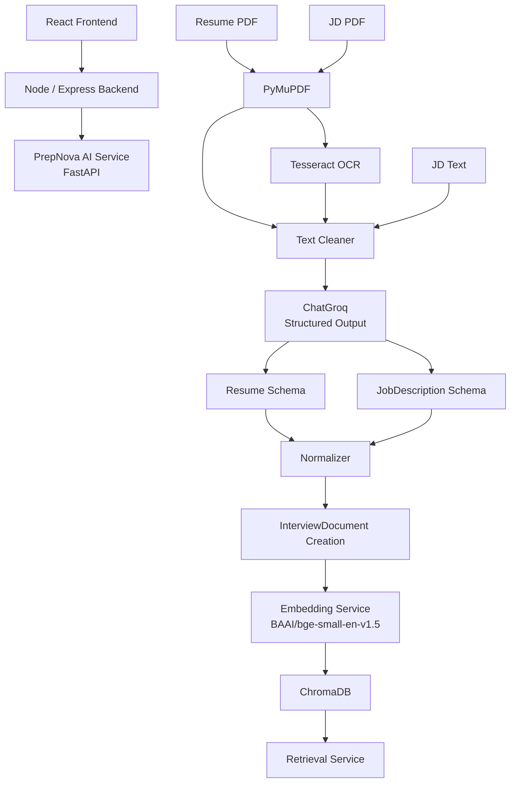

 # PrepNova AI Service

The **PrepNova AI Service** is a FastAPI-based microservice for the AI and RAG layer of **PrepNova — RAG-based Adaptive Mock Interview Platform**.

The service currently handles:

- Resume PDF ingestion and structured extraction
- Job Description (JD) ingestion from PDF or plain text
- Native PDF text extraction with OCR fallback
- Text cleaning and normalization
- Structured LLM extraction using LangChain + Groq
- Pydantic-based schema validation
- Conversion of extracted Resume/JD data into searchable RAG documents
- Embedding generation using `BAAI/bge-small-en-v1.5`
- Persistent ChromaDB vector storage
- User/document-isolated similarity retrieval

The remaining phases will build the role knowledge base, role validation, context planning, question generation, interview evaluation, adaptive difficulty, and reporting on top of this foundation.

---

## Table of Contents

- [Overview](#overview)
- [Current Implementation](#current-implementation)
- [Current Architecture](#current-architecture)
- [Project Structure](#project-structure)
- [RAG and Vector Similarity Strategy](#rag-and-vector-similarity-strategy)
- [Interview Context Modes](#interview-context-modes)
- [Role Knowledge Base](#role-knowledge-base)
- [Tech Stack](#tech-stack)
- [Setup & Installation](#setup--installation)
- [Environment Variables](#environment-variables)
- [Running the Service](#running-the-service)
- [API Endpoints](#api-endpoints)
- [Processing Flows](#processing-flows)
- [Eight-Phase Development Roadmap](#eight-phase-development-roadmap)
- [Security and Data Isolation](#security-and-data-isolation)
- [Design Decisions](#design-decisions)
- [Error Handling](#error-handling)
- [Development Notes](#development-notes)

---

## Overview

PrepNova supports personalized mock interviews using different combinations of:

- Candidate Resume
- Job Description
- Selected Role
- Role Knowledge Base

The AI service is responsible for preparing and retrieving the information that the interview system needs.

The overall AI flow is:

```text
Resume / JD Input
       ↓
Document Processing
       ↓
Structured LLM Extraction
       ↓
Normalization
       ↓
Document / Chunk Creation
       ↓
Embeddings
       ↓
ChromaDB
       ↓
Similarity Retrieval
       ↓
Context Planning
       ↓
Question Generation
       ↓
Answer Evaluation
       ↓
Adaptive Interview
       ↓
Final Report
```

Not every interview mode requires vector similarity. The system uses retrieval where semantic search provides value and uses direct structured data when the information is small and already available.

---

# Current Implementation

## Phase 1 — Document Ingestion and Structured Extraction

### Resume Processing

The service currently accepts Resume PDFs and processes them using:

1. PDF validation
2. Native text extraction with PyMuPDF
3. OCR fallback with Tesseract when the PDF does not contain sufficient readable text
4. Text cleaning
5. Structured extraction using `ChatGroq`
6. Pydantic schema validation

The result is a structured `Resume` object containing information such as:

- Candidate information
- Education
- Experience
- Skills
- Projects
- Certifications
- Achievements
- Links

### Job Description Processing

JDs can currently be provided in two ways:

```text
JD PDF
   ↓
PyMuPDF
   ↓
OCR fallback if required
   ↓
Cleaning
   ↓
Structured LLM extraction
```

or:

```text
JD Plain Text
   ↓
Cleaning
   ↓
Structured LLM extraction
```

The result is a structured `JobDescription` object containing:

- Job information
- Required skills
- Preferred skills
- Education
- Experience requirements
- Responsibilities
- Technologies
- Soft skills
- Qualifications

---

## Phase 2 — RAG Foundation

Phase 2 is currently implemented.

The goal of this phase was to convert structured Resume/JD data into searchable documents and establish a reusable retrieval layer.

### Current RAG Pipeline

```text
Resume / JD JSON
       ↓
Normalization
       ↓
InterviewDocument creation
       ↓
Embedding generation
       ↓
ChromaDB
       ↓
User/document-filtered similarity search
```

### Components Built

#### 1. Normalization

Structured values are cleaned and normalized before being converted into searchable documents.

Examples:

- whitespace normalization
- newline normalization
- empty-value handling
- list normalization
- string conversion

#### 2. Document / Chunk Creation

Resume and JD sections are converted into `InterviewDocument` objects.

Each document contains:

```text
content
source
document_type
section
metadata
```

Example sections include:

```text
Resume:
- candidate
- education
- experience
- skills
- projects

JD:
- job_info
- required_skills
- preferred_skills
- experience
- responsibilities
- technologies
- soft_skills
- qualifications
```

#### 3. Embedding Service

The current embedding model is:

```text
BAAI/bge-small-en-v1.5
```

Embeddings are normalized and generated through LangChain's Hugging Face integration.

#### 4. ChromaDB Vector Store

ChromaDB is used as the persistent vector store.

The current implementation stores metadata such as:

```text
scope
user_id
document_id
source
document_type
section
```

This allows retrieval to be restricted to the authenticated user's document data.

#### 5. Retrieval Service

A reusable retrieval service performs semantic similarity search using:

```text
query
user_id
document_id
top_k
```

This RAG foundation will also be reused by the future Role Knowledge Base.

---

# Current Architecture



The Node/Express backend remains responsible for authentication and authorization, while this service focuses on AI processing and retrieval.

---

# Project Structure

```text
AIService/
│
├── app/
│   ├── api/
│   │   └── routes/
│   │       ├── jd.py
│   │       └── resume.py
│   │
│   ├── core/
│   │   └── config.py
│   │
│   ├── schemas/
│   │   ├── document.py
│   │   ├── jd.py
│   │   └── resume.py
│   │
│   └── services/
│       ├── document/
│       │   ├── cleaner.py
│       │   ├── ocr.py
│       │   └── pdf_parser.py
│       │
│       ├── extraction/
│       │   ├── jd_extractor.py
│       │   └── resume_extractor.py
│       │
│       ├── processing/
│       │   ├── normalizer.py
│       │   └── chunker.py
│       │
│       ├── embeddings/
│       │   └── service.py
│       │
│       ├── vectorstore/
│       │   ├── chroma_store.py
│       │   └── retrieval.py
│       │
│       └── llm/
│           └── client.py
│
├── scripts/
│   └── test_rag.py
│
├── data/
│   └── chroma/
│
├── uploads/
│
├── .env
├── .env.example
├── requirements.txt
├── main.py
└── README.md
```

---

# RAG and Vector Similarity Strategy

Vector similarity is **not used for every operation** in PrepNova.

The main rule is:

> Use vector similarity when the system needs to find semantically relevant information from a collection of documents. Use direct structured data when the required information is already small, explicit, and available.

## Where Vector Similarity Is Used

| Situation | Vector Similarity | Reason |
|---|---:|---|
| Resume only | Optional / selective | Small structured resume can often be passed directly; retrieval becomes useful for larger context |
| JD only | Optional / selective | Structured JD can often be used directly; retrieval helps when the JD is large |
| Resume + JD | Yes / useful | Helps retrieve semantically related candidate and job information |
| Resume + Role | Yes | Resume information is combined with retrieved role knowledge |
| Role only | Yes | Role Knowledge Base must be searched for relevant role topics |
| JD + Role | Yes | Retrieves role knowledge relevant to the JD and selected role |
| Resume + JD + Role | Yes | Combines candidate/JD context with retrieved role knowledge |
| Nothing provided | No | Interview cannot start |

### Important Distinction

Vector similarity is not the same as document extraction.

```text
PDF / Text
   ↓
PDF parser / OCR
   ↓
LLM extraction
   ↓
Structured Resume / JD
```

This stage understands and structures the document.

Vector retrieval happens later:

```text
Structured / Knowledge Documents
   ↓
Embeddings
   ↓
Vector Store
   ↓
Similarity Search
   ↓
Relevant Context
```

For explicit skill matching, deterministic matching can also be used. For example, normalized skills such as `Python`, `FastAPI`, and `Docker` can be compared directly. Semantic similarity is useful when concepts have different wording but similar meaning.

---

# Interview Context Modes

PrepNova supports the following logical input combinations.

| # | Resume | JD | Role | Context |
|---|---|---|---|---|
| 1 | Yes | No | No | Resume |
| 2 | No | Yes | No | JD |
| 3 | Yes | Yes | No | Resume + JD |
| 4 | Yes | No | Yes | Resume + Role |
| 5 | No | No | Yes | Role |
| 6 | No | Yes | Yes | JD + Role |
| 7 | Yes | Yes | Yes | Resume + JD + Role |
| 8 | No | No | No | Invalid — interview cannot start |

The future **Context Planner** will centralize this decision instead of allowing individual components to independently decide which context to use.

---

# Role Knowledge Base

The Role Knowledge Base is a **global knowledge source**, not a user's private document collection.

It will contain curated knowledge for supported interview roles.

Example structure:

```text
role_knowledge/
│
├── ai_engineer/
│   ├── python.md
│   ├── machine_learning.md
│   ├── llm.md
│   ├── rag.md
│   ├── agents.md
│   └── system_design.md
│
├── backend_engineer/
│   ├── python.md
│   ├── databases.md
│   ├── api.md
│   └── system_design.md
│
└── data_engineer/
    ├── sql.md
    ├── spark.md
    └── data_pipeline.md
```

These files will be chunked and embedded using the same embedding service already built in Phase 2.

The role knowledge will be stored in ChromaDB with global metadata such as:

```text
scope: global
document_type: role
role: AI Engineer
section: rag
```

## Role Selection Flow

When a user selects a role, the system does **not** simply pass the role name to the LLM.

Instead:

```text
User selects "AI Engineer"
          ↓
Role Knowledge Base
          ↓
Filter by role = "AI Engineer"
          ↓
Semantic similarity retrieval
          ↓
Relevant topics / chunks
          ↓
Interview Context
          ↓
Question Generation
```

For example, if the question-generation system needs information about RAG:

```text
Query:
"Generate an intermediate RAG interview question"

        ↓

Role = AI Engineer

        ↓

Retrieve relevant AI Engineer KB chunks

        ↓

RAG / Retrieval / Vector DB / Evaluation content

        ↓

Question Generator
```

This makes role-based interviews grounded in curated role knowledge instead of relying only on the LLM's general knowledge.

---

# Tech Stack

| Component | Technology | Purpose |
|---|---|---|
| Language | Python | AI service implementation |
| API Framework | FastAPI | AI microservice API |
| ASGI Server | Uvicorn | Local/service execution |
| PDF Parsing | PyMuPDF | Native PDF text extraction |
| OCR | Tesseract / pytesseract | Scanned PDF extraction |
| LLM Orchestration | LangChain | LLM and structured-output integration |
| LLM | Groq / `ChatGroq` | Structured extraction and future generation/evaluation |
| Schema Validation | Pydantic | Structured data validation |
| Embeddings | `BAAI/bge-small-en-v1.5` | Semantic vector representations |
| Vector Store | ChromaDB | Persistent vector storage and retrieval |
| Backend Integration | Node.js / Express | Authentication, authorization, and application orchestration |
| Frontend | React | User-facing interview application |

---

# Setup & Installation

## 1. Prerequisites

- Python 3.10+
- Tesseract OCR
- Git
- A Groq API key

### Windows

Install Tesseract OCR and make sure the executable path is available to the application.

A common installation path is:

```text
C:\Program Files\Tesseract-OCR\tesseract.exe
```

### macOS

```bash
brew install tesseract
```

### Ubuntu / Debian

```bash
sudo apt-get install tesseract-ocr
```

---

## 2. Navigate to the AI Service

```bash
cd AIService
```

---

## 3. Create a Virtual Environment

### Windows PowerShell

```powershell
python -m venv .venv
.venv\Scripts\Activate.ps1
```

### macOS / Linux

```bash
python3 -m venv .venv
source .venv/bin/activate
```

---

## 4. Install Dependencies

```bash
pip install -r requirements.txt
```

---

## 5. Configure Environment Variables

Copy the example environment file:

```bash
cp .env.example .env
```

Then configure the required values.

---

# Environment Variables

| Variable | Required | Description |
|---|---:|---|
| `GROQ_API_KEY` | Yes | API key used to access Groq |
| `GROQ_MODEL` | No | Groq-supported model identifier |
| `TESSERACT_CMD` | No | Tesseract executable path when it is not available on system PATH |

Never commit `.env` containing API keys or other secrets.

---

# Running the Service

Start the FastAPI service:

```bash
uvicorn main:app --reload
```

The local service will normally be available at:

```text
http://127.0.0.1:8000
```

Swagger documentation:

```text
http://127.0.0.1:8000/docs
```

ReDoc:

```text
http://127.0.0.1:8000/redoc
```

---

# API Endpoints

## Health Check

```text
GET /health
```

Used to verify that the AI service is running.

## Resume Extraction

```text
POST /resume/extract
```

Accepts a Resume PDF and returns structured Resume data.

## Job Description Extraction

```text
POST /jd/extract
```

Accepts either:

- JD PDF
- JD plain text

and returns structured Job Description data.

> Detailed example request/response payloads are intentionally omitted from this README to keep the documentation focused on the implemented architecture rather than sample data.

---

# Processing Flows

## Resume

```text
Resume PDF
   ↓
File Validation
   ↓
PyMuPDF
   ↓
Readable Text?
   ├── Yes → Cleaning
   └── No  → Tesseract OCR → Cleaning
                         ↓
                  ChatGroq
                         ↓
                 Resume Schema
                         ↓
                    Normalizer
                         ↓
                InterviewDocuments
                         ↓
                    Embeddings
                         ↓
                    ChromaDB
```

## Job Description

```text
JD PDF / JD Text
       ↓
PDF Parsing if required
       ↓
OCR fallback if required
       ↓
Text Cleaning
       ↓
ChatGroq
       ↓
JobDescription Schema
       ↓
Normalizer
       ↓
InterviewDocuments
       ↓
Embeddings
       ↓
ChromaDB
```

---

# Eight-Phase Development Roadmap

The AI service is being developed incrementally. The first two phases are already implemented.

## Phase 1 — Document Intelligence
**Status: Implemented**

Build the document ingestion and structured extraction foundation.

### Completed

- Resume PDF processing
- JD PDF processing
- JD plain-text processing
- PyMuPDF extraction
- Tesseract OCR fallback
- Text cleaning
- ChatGroq integration
- Pydantic structured output
- Resume and JD schemas

---

## Phase 2 — RAG Foundation
**Status: Implemented**

Build reusable semantic storage and retrieval.

### Completed

- Text normalization
- Resume/JD document conversion
- Chunk/document creation
- `BAAI/bge-small-en-v1.5` embeddings
- Persistent ChromaDB
- Similarity retrieval
- User/document metadata filtering
- Reusable retrieval service

This phase provides the vector infrastructure required by the later role and interview features.

---

## Phase 3 — Role Knowledge Base & Role Retrieval
**Status: Planned**

Build a curated global knowledge base for interview roles.

### Planned

- Create role-specific knowledge files
- Chunk role knowledge
- Generate embeddings
- Store role knowledge in ChromaDB
- Add global metadata such as `role` and `section`
- Implement role-filtered retrieval
- Reuse the existing embedding and ChromaDB infrastructure

Main flow:

```text
Selected Role
     ↓
Role Knowledge Base
     ↓
Role Filter
     ↓
Semantic Retrieval
     ↓
Relevant Role Context
```

---

## Phase 4 — Role Validation
**Status: Planned**

Validate whether a selected role is consistent with the provided Resume and/or JD.

Examples:

```text
Resume + Role
        ↓
Does Resume match selected Role?
```

```text
JD + Role
        ↓
Does JD match selected Role?
```

```text
Resume + JD + Role
        ↓
Evaluate role consistency with provided context
```

If the selected role is not compatible with the provided context, the system can stop or request a different role rather than generating unrelated interview questions.

---

## Phase 5 — Context Planner
**Status: Planned**

Create one central component responsible for deciding which sources should be used for an interview.

Example decisions:

```text
Resume only
    → Resume context
```

```text
Role only
    → Role Knowledge Base retrieval
```

```text
Resume + JD
    → Resume + JD context
```

```text
Resume + Role
    → Resume + Role Knowledge Base
```

```text
JD + Role
    → JD + Role Knowledge Base
```

```text
Resume + JD + Role
    → Resume + JD + Role Knowledge Base
```

This prevents context-selection logic from being duplicated across multiple services.

---

## Phase 6 — Question Generation & Interview Session
**Status: Planned**

Build the actual mock interview engine.

### Planned capabilities

- Technical questions
- Behavioral questions
- Scenario questions
- Project questions
- Skill-based questions
- Resume deep-dive questions
- JD-focused questions
- Role-based questions
- Coding/debugging questions
- Difficulty-aware questions
- Follow-up questions
- Duplicate-question prevention

The question generator will receive grounded context from the Context Planner rather than generating every question from unrestricted LLM knowledge.

---

## Phase 7 — Answer Evaluation & Adaptive Difficulty
**Status: Planned**

Evaluate candidate answers and adapt the next question.

### Evaluation dimensions

- Relevance
- Technical correctness
- Completeness
- Clarity
- Depth

Different answer types can use different evaluation methods:

```text
MCQ
→ Exact answer matching

Short Answer
→ Semantic similarity + keyword checks

Scenario / Subjective
→ LLM-based evaluation

Coding / Debugging
→ Test cases + LLM review

Behavioral
→ STAR-based evaluation
```

### Adaptive Difficulty

The interview difficulty will change based on the candidate's previous performance.

Planned rule:

```text
Score >= 8
    → Increase difficulty

Score <= 4
    → Decrease difficulty

Score 5–7
    → Keep difficulty similar
```

---

## Phase 8 — Reports, History & Production Readiness
**Status: Planned**

Complete the end-to-end interview experience.

### Planned capabilities

- Final interview report
- Technical performance summary
- Problem-solving evaluation
- Communication evaluation
- Resume/JD alignment
- ATS-lite scoring
- Interview history
- Session persistence
- Abandoned-interview handling
- Duplicate-question handling
- Failure recovery
- Performance optimization
- Security hardening
- End-to-end testing
- Deployment and CI/CD integration

---

# Security and Data Isolation

User-specific vector data must remain isolated.

The ChromaDB metadata for user documents follows the concept:

```text
scope: user
user_id: <authenticated-user-id>
document_id: <document-id>
document_type: resume / jd
section: <section>
```

Retrieval can therefore be restricted to:

```text
user_id + document_id
```

### Important Security Rule

The frontend must **not** be trusted to provide an arbitrary `user_id`.

The intended flow is:

```text
React
  ↓
JWT
  ↓
Node / Express
  ↓
Authenticate user
  ↓
Derive trusted user_id
  ↓
Verify document ownership
  ↓
Call AI Service
  ↓
AI retrieval filtered by user_id/document_id
```

ChromaDB filtering is a defense-in-depth mechanism. Authorization should primarily be enforced by the Node/Express backend.

Role Knowledge Base documents are different:

```text
scope: global
document_type: role
role: AI Engineer
```

These are shared knowledge resources and must not be mixed with private user document data.

---

# Design Decisions

## 1. Structured Extraction Before Retrieval

Resume and JD information is first converted into structured Pydantic objects.

This makes downstream processing predictable and easier to validate.

## 2. Vector Retrieval Is Selective

The system does not force every piece of data through vector similarity.

Small, structured information can be passed directly.

Vector retrieval is mainly useful when the system needs to discover semantically relevant information from a larger collection.

## 3. One Reusable Vector Infrastructure

The same ChromaDB and embedding infrastructure will support:

- User Resume/JD retrieval
- Role Knowledge Base retrieval
- Future question retrieval
- Duplicate-question detection where required
- Other semantic matching tasks

The project does not create a separate vector system for every feature.

## 4. Global Role Knowledge vs. Private User Data

Role knowledge is shared/global.

Resume and JD data are user-specific.

The two scopes are kept separate through metadata and retrieval filters.

## 5. Deterministic Matching + Semantic Matching

Not every matching problem requires embeddings.

For explicit skills:

```text
Python
FastAPI
Docker
```

normalized deterministic matching can be used.

For semantically related concepts:

```text
"retrieval augmented generation"
vs.
"RAG-based applications"
```

vector similarity can provide semantic matching.

Both approaches can be used together.

---

# Error Handling

The service is expected to handle cases such as:

- Invalid file type
- Corrupt PDF
- Scanned PDF
- Empty or unreadable document
- Missing JD input
- OCR failure
- LLM failure
- Embedding failure
- ChromaDB failure
- Invalid document/user scope
- Duplicate documents
- Duplicate interview questions
- Empty candidate answers
- Invalid or expired authentication
- Unauthorized document access

Each later phase will add the error handling required by its own functionality.

---

# Development Notes

### Secrets

Keep API keys in `.env`.

Never commit secrets to Git.

### Schema Changes

When Resume or JD fields change:

```text
app/schemas/
```

should be updated along with the corresponding extraction logic.

### LLM Client

Use the centralized:

```text
app/services/llm/client.py
```

for LLM configuration rather than creating independent clients throughout the service.

### RAG Components

RAG-related functionality should remain separated into:

```text
processing/
embeddings/
vectorstore/
```

This keeps normalization, embedding generation, storage, and retrieval independently maintainable.

### Future AI Components

As the roadmap progresses, new responsibilities should remain modular rather than placing the complete interview workflow inside a single FastAPI route.

---

## Current Status

```text
Phase 1  Document Intelligence              ✅ Implemented
Phase 2  RAG Foundation                    ✅ Implemented
Phase 3  Role Knowledge Base               🔜 Planned
Phase 4  Role Validation                   🔜 Planned
Phase 5  Context Planner                   🔜 Planned
Phase 6  Question Generation & Interview   🔜 Planned
Phase 7  Evaluation & Adaptive Difficulty  🔜 Planned
Phase 8  Reports & Production Readiness    🔜 Planned
```

The current implementation therefore provides the **document-processing and reusable RAG foundation**, while the remaining phases build the actual adaptive mock-interview intelligence on top of it.
