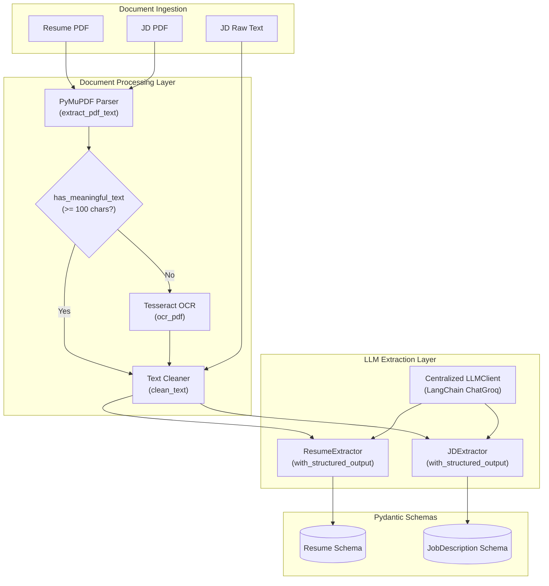

# PrepNova AI Service

The **PrepNova AI Service** is a FastAPI-powered microservice responsible for ingesting, parsing, and extracting structured information from candidate resumes and job descriptions (JDs). It transforms unstructured documents (PDFs and plain text) into validated, schema-compliant JSON representations ready for downstream interview preparation, candidate matching, and RAG (Retrieval-Augmented Generation) pipelines.

---

## Table of Contents

- [Overview](#overview)
- [Current Features](#current-features)
- [Architecture](#architecture)
- [Project Structure](#project-structure)
- [Tech Stack](#tech-stack)
- [Setup & Installation](#setup--installation)
- [Environment Variables](#environment-variables)
- [Running the Service](#running-the-service)
- [API Endpoints](#api-endpoints)
  - [Health Check](#1-health-check)
  - [Resume Extraction](#2-resume-extraction)
  - [Job Description Extraction](#3-job-description-extraction)
- [Processing Flow](#processing-flow)
- [Design Decisions](#design-decisions)
- [Error Handling](#error-handling)
- [Current Scope vs. Future Work](#current-scope-vs-future-work)
- [Development Notes](#development-notes)

---

## Overview

In the PrepNova ecosystem, raw resumes and job descriptions come in varied formats (digital PDFs, scanned documents, or raw text pasted from job boards). This service acts as the dedicated ingestion and parsing layer:

1. **Document Ingestion & Text Extraction**: Reads digital PDF text natively and automatically falls back to OCR for scanned or image-heavy pages.
2. **Text Normalization**: Cleans whitespace, removes null bytes, and normalizes formatting.
3. **Structured LLM Extraction**: Leverages LangChain and Groq LLMs (`ChatGroq`) with strict Pydantic schemas to output deterministic, structured data without manual JSON parsing.

---

## Current Features

- **Resume PDF Extraction**: Accepts resume PDF uploads and extracts full profile details.
- **Dual JD Ingestion**: Supports Job Descriptions uploaded as PDFs or supplied directly as plain text.
- **Native PDF Parsing**: High-speed text extraction via PyMuPDF (`pymupdf`).
- **Automatic OCR Fallback**: Integrated Tesseract OCR (`pytesseract`) that triggers when native PDF text contains fewer than 100 alphanumeric characters.
- **Text Preprocessing**: Cleans control characters, excessive whitespace, and irregular line breaks while preserving document flow.
- **Structured LLM Extraction**: Uses LangChain's `.with_structured_output()` binding to ensure model responses adhere strictly to defined Pydantic models.
- **Dedicated Domain Schemas**: Separate, tailored schemas for Resumes and Job Descriptions.
- **Centralized LLM Configuration**: Unified `LLMClient` with temperature control, token limits, and retries.
- **Deterministic Output**: Uses temperature `0` for consistent and reproducible information extraction.

---

## Architecture

The service cleanly separates **document processing** (I/O, parsing, OCR, text cleaning) from **semantic extraction** (prompts, LLM client, Pydantic schemas).



### Key Architectural Characteristics
- **Shared Document Pipeline**: Both Resume and JD PDF workflows share the identical `pdf_parser`, `ocr`, and `cleaner` utilities.
- **Shared LLM Client**: Both extractors reuse `LLMClient` initialized from application configuration.
- **Isolated Domain Schemas**: Resumes and Job Descriptions have fundamentally different structures and are parsed using isolated extractors and schemas.

---

## Project Structure

```
AIService/
├── app/
│   ├── api/
│   │   └── routes/
│   │       ├── jd.py                  # POST /jd/extract endpoint
│   │       └── resume.py              # POST /resume/extract endpoint
│   ├── core/
│   │   └── config.py                  # Pydantic Settings & environment loader
│   ├── schemas/
│   │   ├── jd.py                      # Pydantic models: JobInfo, Requirements, JobDescription
│   │   └── resume.py                  # Pydantic models: CandidateInfo, Education, Experience, Skills, Project, Resume
│   └── services/
│       ├── document/
│       │   ├── cleaner.py             # Text cleaning & heuristic validation
│       │   ├── ocr.py                 # Tesseract OCR rendering & text extraction
│       │   └── pdf_parser.py          # Native PyMuPDF text extractor
│       ├── extraction/
│       │   ├── jd_extractor.py        # LangChain JD prompt & structured extraction
│       │   └── resume_extractor.py    # LangChain Resume prompt & structured extraction
│       └── llm/
│           └── client.py              # Centralized ChatGroq instance provider
├── uploads/                           # Temporary file storage during upload processing
├── .env.example                       # Reference environment variables
├── .env                               # Local environment variables (gitignored)
├── main.py                            # FastAPI application entrypoint & health check
├── requirements.txt                   # Python package dependencies
└── README.md                          # Service documentation
```

### File Responsibilities

| File | Responsibility |
|---|---|
| `main.py` | Initializes the FastAPI app, registers API routers, and defines the `/health` endpoint. |
| `app/core/config.py` | Loads and validates environment variables (`GROQ_API_KEY`, `GROQ_MODEL`, `TESSERACT_CMD`) via `pydantic-settings`. |
| `app/api/routes/resume.py` | Handles resume upload, temporary disk staging, PDF/OCR extraction, LLM invocation, and temp file cleanup. |
| `app/api/routes/jd.py` | Handles JD extraction from either multipart PDF upload or direct form text input. |
| `app/schemas/resume.py` | Defines Pydantic models for CandidateInfo, Education, Experience, Skills, Projects, and Resume. |
| `app/schemas/jd.py` | Defines Pydantic models for JobInfo, Requirements, Responsibilities, and JobDescription. |
| `app/services/document/pdf_parser.py` | Extracts text streams from digital PDFs using PyMuPDF. |
| `app/services/document/ocr.py` | Renders PDF pages to 200 DPI images and extracts text using Tesseract OCR. |
| `app/services/document/cleaner.py` | Strips invalid characters, normalizes whitespace, and checks text sufficiency heuristics. |
| `app/services/llm/client.py` | Configures and instantiates `ChatGroq` with temperature `0` and 2 max retries. |
| `app/services/extraction/resume_extractor.py` | Binds the `Resume` schema to the LLM and runs the zero-shot extraction prompt. |
| `app/services/extraction/jd_extractor.py` | Binds the `JobDescription` schema to the LLM and runs the JD extraction prompt. |

---

## Tech Stack

| Component | Technology | Purpose |
|---|---|---|
| **Language** | Python 3.10+ | Core development language |
| **Web Framework** | FastAPI | High-performance asynchronous API framework |
| **ASGI Server** | Uvicorn | ASGI web server for running FastAPI |
| **Document Parsing** | PyMuPDF (`pymupdf`) | Fast native PDF text and image rendering |
| **OCR Engine** | Tesseract OCR (`pytesseract`) | Optical Character Recognition for scanned documents |
| **LLM Orchestration** | LangChain (`langchain`, `langchain-groq`) | Structured output pipeline and prompt management |
| **LLM Inference** | Groq Cloud (`ChatGroq`) | Fast inference via models like `openai/gpt-oss-20b` |
| **Schema Validation** | Pydantic / Pydantic Settings | Data parsing, type validation, and config loading |

---

## Setup & Installation

### 1. Prerequisites
- **Python**: Version 3.10, 3.11, or 3.12 installed.
- **Tesseract OCR** (Required for OCR fallback on scanned PDFs):
  - **Windows**: Download and install from [UB-Mannheim/tesseract](https://github.com/UB-Mannheim/tesseract/wiki). Default path is usually `C:\Program Files\Tesseract-OCR\tesseract.exe`.
  - **macOS**: `brew install tesseract`
  - **Linux (Ubuntu/Debian)**: `sudo apt-get install tesseract-ocr`

### 2. Clone and Navigate to Service
```bash
cd AIService
```

### 3. Create and Activate Virtual Environment
- **Windows (PowerShell)**:
  ```powershell
  python -m venv .venv
  .venv\Scripts\Activate.ps1
  ```
- **macOS / Linux**:
  ```bash
  python3 -m venv .venv
  source .venv/bin/activate
  ```

### 4. Install Dependencies
```bash
pip install -r requirements.txt
```

### 5. Configure Environment Variables
Copy `.env.example` to `.env` and fill in your values:
```bash
cp .env.example .env
```

---

## Environment Variables

Configured in `app/core/config.py`:

| Variable | Type | Required | Default | Description |
|---|---|---|---|---|
| `GROQ_API_KEY` | `string` | **Yes** | — | API key for Groq Cloud LLM access. |
| `GROQ_MODEL` | `string` | No | `openai/gpt-oss-20b` | Groq-supported model identifier to use for extraction. |
| `TESSERACT_CMD` | `string` | No | `None` | Absolute executable path to Tesseract binary (e.g. `C:\Program Files\Tesseract-OCR\tesseract.exe`). If omitted, pytesseract looks for `tesseract` on system `PATH`. |

> [!WARNING]
> Never commit `.env` containing live API keys or secrets to version control.

---

## Running the Service

Start the local development server with auto-reload:

```bash
uvicorn main:app --reload
```

- **Base URL**: `http://127.0.0.1:8000`
- **Interactive OpenAPI (Swagger) Docs**: [http://127.0.0.1:8000/docs](http://127.0.0.1:8000/docs)
- **Alternative ReDoc Documentation**: [http://127.0.0.1:8000/redoc](http://127.0.0.1:8000/redoc)

---

## API Endpoints

### 1. Health Check

Checks service operational status.

- **Method**: `GET`
- **Path**: `/health`
- **Response**: `200 OK`
  ```json
  {
    "status": "ok",
    "service": "prep-nova-ai-service"
  }
  ```

---

### 2. Resume Extraction

Extracts structured resume data from an uploaded PDF file.

- **Method**: `POST`
- **Path**: `/resume/extract`
- **Content-Type**: `multipart/form-data`
- **Request Parameters**:
  - `file` (*UploadFile*, required): The resume file in `.pdf` format.

#### Example Request (`cURL`):
```bash
curl -X POST "http://127.0.0.1:8000/resume/extract" \
  -H "accept: application/json" \
  -H "Content-Type: multipart/form-data" \
  -F "file=@/path/to/resume.pdf"
```

#### Example Response (`200 OK`):
```json
{
  "success": true,
  "extraction_method": "pdf_text",
  "resume": {
    "candidate": {
      "name": "Jane Doe",
      "email": "jane.doe@example.com",
      "phone": "+1 (555) 019-2834",
      "location": "San Francisco, CA"
    },
    "summary": "Full Stack Engineer with 4+ years of experience building scalable microservices and web applications.",
    "education": [
      {
        "degree": "Bachelor of Science",
        "institution": "University of California, Berkeley",
        "field": "Computer Science",
        "start_year": "2018",
        "end_year": "2022"
      }
    ],
    "experience": [
      {
        "company": "Tech Innovations Inc.",
        "role": "Software Engineer",
        "start_date": "2022-07",
        "end_date": "Present",
        "description": [
          "Developed high-throughput REST APIs using FastAPI and PostgreSQL.",
          "Implemented CI/CD pipelines reducing deployment turnaround by 35%."
        ],
        "technologies": [
          "Python",
          "FastAPI",
          "PostgreSQL",
          "Docker"
        ]
      }
    ],
    "skills": {
      "programming_languages": ["Python", "JavaScript", "TypeScript", "SQL"],
      "frameworks": ["FastAPI", "React", "Node.js"],
      "databases": ["PostgreSQL", "Redis"],
      "cloud": ["AWS"],
      "ai_ml": ["LangChain", "PyTorch"],
      "tools": ["Git", "Docker", "Linux"],
      "other": ["Agile/Scrum", "System Design"]
    },
    "projects": [
      {
        "name": "Real-time Analytics Engine",
        "description": "Distributed streaming platform processing event logs.",
        "technologies": ["Python", "Redis", "FastAPI"],
        "responsibilities": [
          "Built telemetry collectors and WebSocket streaming endpoints."
        ]
      }
    ],
    "certifications": [
      "AWS Certified Solutions Architect – Associate"
    ],
    "achievements": [
      "First Place in University Hackathon 2021"
    ],
    "links": [
      "https://github.com/janedoe",
      "https://linkedin.com/in/janedoe"
    ]
  }
}
```

---

### 3. Job Description Extraction

Extracts structured job requirements and details from either a PDF file or direct text input.

- **Method**: `POST`
- **Path**: `/jd/extract`
- **Content-Type**: `multipart/form-data`
- **Request Parameters** *(Provide either `file` or `text`)*:
  - `file` (*UploadFile*, optional): Job description PDF file.
  - `text` (*string / Form*, optional): Job description plain text.

#### Example Request 1: Direct Text Input (`cURL`)
```bash
curl -X POST "http://127.0.0.1:8000/jd/extract" \
  -H "accept: application/json" \
  -H "Content-Type: multipart/form-data" \
  -F "text=We are looking for a Senior Python Developer at Acme Corp in Austin, TX. Required skills: Python, FastAPI, Docker. 4+ years of experience required. Responsibilities include building scalable APIs and mentoring juniors."
```

#### Example Request 2: PDF File Input (`cURL`)
```bash
curl -X POST "http://127.0.0.1:8000/jd/extract" \
  -H "accept: application/json" \
  -H "Content-Type: multipart/form-data" \
  -F "file=@/path/to/job_description.pdf"
```

#### Example Response (`200 OK`):
```json
{
  "job_info": {
    "title": "Senior Python Developer",
    "company": "Acme Corp",
    "location": "Austin, TX",
    "employment_type": "Full-time"
  },
  "requirements": {
    "required_skills": [
      "Python",
      "FastAPI",
      "Docker"
    ],
    "preferred_skills": [
      "Kubernetes",
      "Redis"
    ],
    "education": [
      "Bachelor's degree in Computer Science or related technical field"
    ],
    "experience": [
      "4+ years of professional backend software development"
    ]
  },
  "responsibilities": {
    "items": [
      "Architect and implement scalable backend APIs using FastAPI.",
      "Collaborate with cross-functional engineering and product teams.",
      "Mentor junior team members and participate in code reviews."
    ]
  },
  "technologies": [
    "Python",
    "FastAPI",
    "Docker",
    "PostgreSQL",
    "Git"
  ],
  "soft_skills": [
    "Mentorship",
    "Problem solving",
    "Communication"
  ],
  "qualifications": [
    "Demonstrated experience designing distributed systems."
  ]
}
```

---

## Processing Flow

### A. Resume Processing Flow
1. **File Type Validation**: Endpoint verifies MIME type is `application/pdf`.
2. **Temporary Staging**: Saves the uploaded binary to `uploads/<uuid>.pdf`.
3. **Native Text Extraction**: Attempts text extraction via `extract_pdf_text()` using PyMuPDF.
4. **Heuristic OCR Fallback**: If extracted text has `< 100` alphanumeric characters (`has_meaningful_text`), renders pages at 200 DPI and invokes Tesseract OCR (`ocr_pdf()`).
5. **Sanitization**: Strips null bytes (`\x00`), condenses whitespace, and standardizes multi-newlines via `clean_text()`.
6. **Structured Extraction**: Prompts the LLM client with strict rules and the Pydantic `Resume` schema.
7. **Cleanup**: Temporary disk file is unlinked in a `finally` block regardless of extraction outcome.
8. **Response Return**: Returns JSON payload with `extraction_method` (`pdf_text` or `ocr`) and the structured `resume` object.

### B. Job Description Processing Flow (PDF)
1. **File Staging**: Writes upload to a temporary file via Python's `tempfile.NamedTemporaryFile`.
2. **Native Parsing & OCR Fallback**: Performs PyMuPDF text extraction followed by Tesseract OCR if text is sparse.
3. **Sanitization & Validation**: Cleans text and verifies meaningful character count.
4. **Structured Extraction**: Prompts LLM with the Pydantic `JobDescription` schema.
5. **Cleanup & Return**: Deletes temporary file and returns structured JD JSON.

### C. Job Description Processing Flow (Direct Text)
1. **Direct Cleaning**: Bypasses PDF/OCR stages and passes text directly through `clean_text()`.
2. **Sufficiency Check**: Validates that meaningful alphanumeric content is present (`has_meaningful_text()`).
3. **Structured Extraction**: Passes cleaned text to `JDExtractor` and returns structured JD JSON.

---

## Design Decisions

- **Native Text Extraction Before OCR**: Native PDF parsing is order-of-magnitude faster and uses minimal CPU. OCR is only invoked when text streams are missing or unreadable (e.g. scanned resumes).
- **Heuristic OCR Threshold**: The 100-character alphanumeric check reliably detects scanned PDFs, vector-only drawings, or PDFs where text is embedded as raster images.
- **Separated Domain Schemas**: Resumes describe individual histories (candidates, degrees, past roles, personal links), whereas Job Descriptions describe hiring requirements (responsibilities, required vs. preferred skills). Distinct schemas eliminate schema pollution and improve LLM parsing accuracy.
- **Flexible JD Inputs**: Allows users and client applications to submit either structured PDF job specs or quickly paste plain text copied directly from web portals.
- **Centralized `LLMClient`**: Avoids repeated LLM client instantiation and provides a single location to update model versions, temperature, retry logic, or API providers.
- **Pydantic Structured Output**: LangChain's `with_structured_output()` forces the LLM to adhere to the target JSON schema natively, preventing JSON decoding errors or missing fields.

---

## Error Handling

| Scenario | HTTP Status | Response Details |
|---|---|---|
| Uploaded file is not a PDF (`/resume/extract`, `/jd/extract`) | `400 Bad Request` | `{"detail": "Only PDF files are supported."}` |
| Neither `file` nor `text` supplied (`/jd/extract`) | `400 Bad Request` | `{"detail": "Provide either JD text or a PDF file."}` |
| JD content has insufficient readable text (`/jd/extract`) | `400 Bad Request` | `{"detail": "Could not extract meaningful JD content."}` |
| Resume text completely empty after parsing & OCR (`/resume/extract`) | `422 Unprocessable Entity` | `{"detail": "Could not extract text from resume."}` |
| Temporary file creation during extraction | Cleaned up | Handled via `try...finally` to ensure no orphan files remain on disk. |

---

## Current Scope vs. Future Work

### Implemented Now
- Ingestion and parsing of Resume PDFs.
- Ingestion and parsing of Job Description PDFs and raw text strings.
- Native PyMuPDF text extraction and Tesseract OCR fallback.
- Text cleaning and heuristic validation.
- Zero-shot structured LLM extraction via LangChain `ChatGroq`.
- Pydantic schema validation for Resume and JD entities.
- REST API endpoints (`/health`, `/resume/extract`, `/jd/extract`).

### Future Roadmap (Planned Components)
The following components are **not yet implemented** in this service and represent planned phases:
- **Text Chunking**: Recursive semantic chunking for long documents.
- **Embeddings Pipeline**: Generating vector embeddings for skills, experiences, and requirements.
- **Vector Store Integration**: Storing and indexing embeddings in a vector database.
- **RAG Retrieval Engine**: Contextual similarity matching between resumes and job specifications.
- **Interview Question Generation**: Automated technical and behavioral question generation based on matched gaps.
- **Answer Evaluation**: Scoring candidate responses against expected criteria.
- **Adaptive Difficulty**: Dynamically adjusting question difficulty based on prior answers.
- **Multi-Turn Interview Orchestration**: State-machine-based interview flows using LangGraph.
- **Candidate Evaluation Reports**: Generation of comprehensive post-interview feedback summaries.

---

## Development Notes

- **Environment Secrets**: Store your `GROQ_API_KEY` in `.env`. Never hardcode keys or commit `.env` files.
- **Schema Separation**: If new fields are added, modify `app/schemas/resume.py` or `app/schemas/jd.py` and update the corresponding extraction prompt rules.
- **Centralized LLM Instance**: Always import `LLMClient` from `app.services.llm.client` when adding new extraction services to maintain consistent model settings.
- **Document Processing Isolation**: Keep document I/O and text cleanup in `app/services/document/` decoupled from prompt engineering in `app/services/extraction/`.