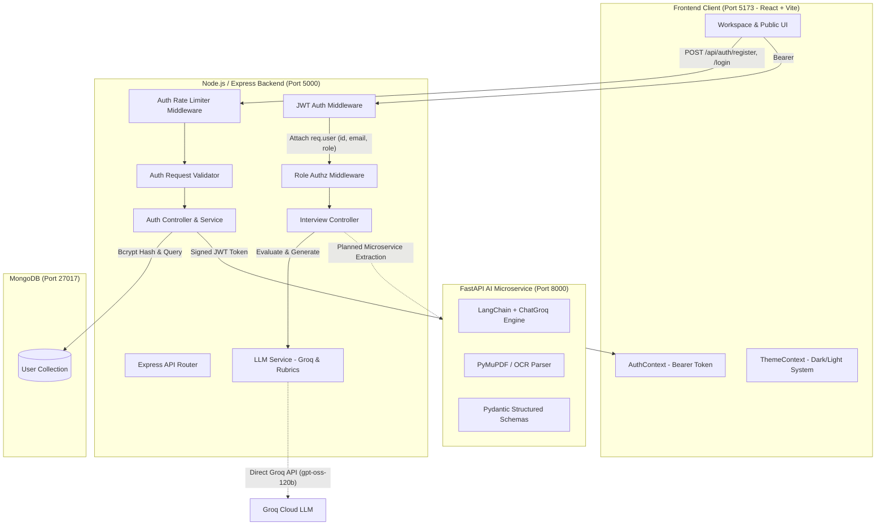
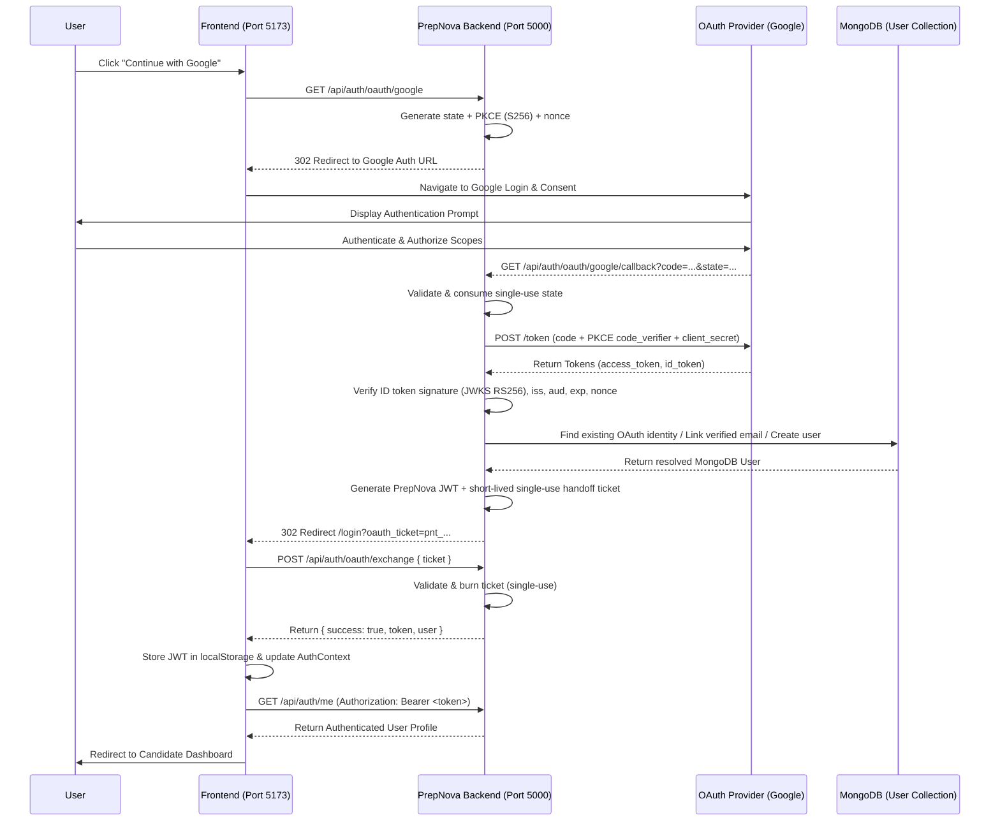
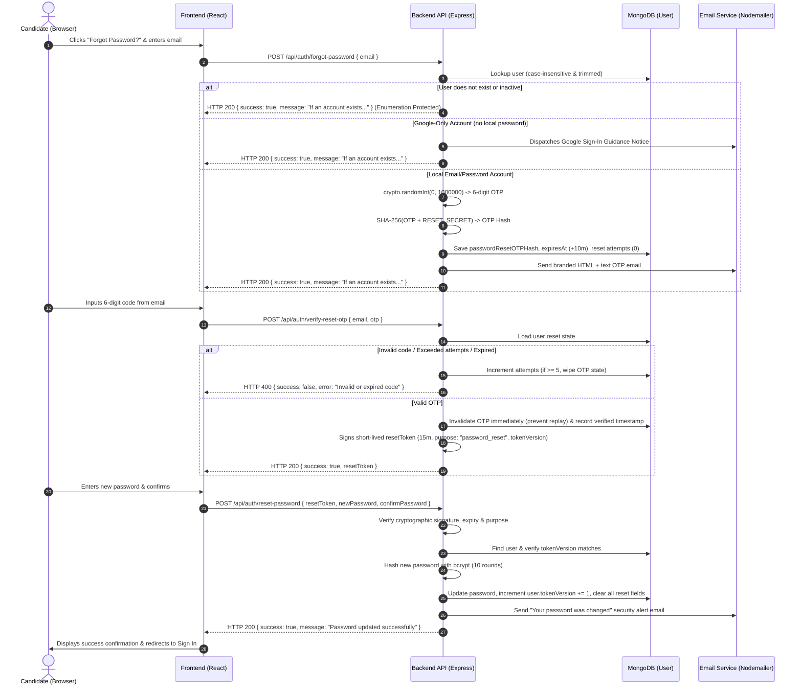

# PrepNova

PrepNova is a modern, AI-powered mock interview simulator and technical preparation workspace featuring a Node.js/Express backend, MongoDB persistence, a Python FastAPI AI extraction microservice, and a responsive React frontend styled with modern SaaS design tokens.

---

## Current Project Status

| Component | Status | Operational Port / Service | Verification |
| :--- | :--- | :--- | :--- |
| **Authentication & Authz** | **PRODUCTION-READY** | `http://localhost:5000/api/auth` | 69 Passing Tests (OAuth 2.0 PKCE, OIDC Nonce, JWT, User Deletion 401, Logout Revocation, Role Guards) |
| **Database Persistence** | **REAL / CONNECTED** | `mongodb://127.0.0.1:27017/prepnova` | Mongoose `User` model, OAuth provider linking, fail-fast buffering protection |
| **Node.js Interview Engine** | **HYBRID / FUNCTIONAL** | `http://localhost:5000/api/interview` | Dynamic question generation with questionBank rubrics & Groq fallback |
| **FastAPI AI Microservice** | **STANDALONE REAL** | `http://127.0.0.1:8000` | LangChain / Groq / PyMuPDF OCR (not yet invoked by Node backend) |
| **Frontend Web App** | **PRODUCTION-READY** | `http://127.0.0.1:5173` | Modern SaaS design system, real backend API integration, Vite build pass |

---

## Current Implementation Audit

The following table documents the audited status of every feature in the PrepNova repository:

| Feature | Status | Real / Mock / Partial | Frontend Connected | Backend Connected | Database | AI Integration | Code Evidence |
| :--- | :--- | :--- | :--- | :--- | :--- | :--- | :--- |
| **User Registration** | IMPLEMENTED | REAL | Yes | Yes | MongoDB (`User`) | N/A | `backend/src/controllers/auth.controller.js`, `models/User.js` |
| **Password Hashing** | IMPLEMENTED | REAL (bcrypt 10 rounds) | Yes | Yes | MongoDB (`password` hash) | N/A | `backend/src/services/auth.service.js` |
| **User Login & JWT** | IMPLEMENTED | REAL (HS256 signed JWT) | Yes | Yes | MongoDB (`User.findOne`) | N/A | `backend/src/utils/jwt.js`, `controllers/auth.controller.js` |
| **Auth Middleware** | IMPLEMENTED | REAL | Yes | Yes | N/A | N/A | `backend/src/middleware/auth.middleware.js` |
| **Role Authorization** | IMPLEMENTED | REAL | Yes | Yes | N/A | N/A | `backend/src/middleware/authorize.middleware.js` |
| **User Isolation** | IMPLEMENTED | REAL | Yes | Yes | Scoped to `req.user.id` | N/A | `backend/src/controllers/interview.controller.js` |
| **Auth Rate Limiting** | IMPLEMENTED | REAL | Yes | Yes | In-memory IP window | N/A | `backend/src/middleware/rateLimiter.middleware.js` |
| **Interview Generation** | IMPLEMENTED | HYBRID | Yes | Yes | Memory session cache | Groq fallback + local rubrics | `backend/src/services/llm.service.js`, `questionBank.service.js` |
| **Answer Scoring** | IMPLEMENTED | HYBRID | Yes | Yes | Memory session cache | Keyword rubrics + Groq evaluation | `backend/src/services/llm.service.js` |
| **FastAPI Resume Extract**| IMPLEMENTED | REAL (Standalone) | No (Direct) | No (Unconnected) | N/A | LangChain + ChatGroq + PyMuPDF | `AIService/services/resume_extractor.py` |
| **FastAPI JD Extract** | IMPLEMENTED | REAL (Standalone) | No (Direct) | No (Unconnected) | N/A | LangChain + ChatGroq + Pydantic | `AIService/services/jd_extractor.py` |
| **RAG / Vector Store** | PROTOTYPE | PARTIAL (Offline) | No | No (Unconnected) | Local Chroma/ChromaDB script | Sentence-Transformers | `backend/rag/search.py` |
| **Candidate Dashboard**| IMPLEMENTED | REAL + HONEST | Yes | Yes | Auth Profile & Real Sessions | N/A | `frontend/src/pages/Dashboard.jsx` |
| **Scorecard Reports** | IMPLEMENTED | REAL | Yes | Yes | Passed from completed session | Rubric score breakdown | `frontend/src/pages/ResultsPage.jsx` |
| **History Table** | IMPLEMENTED | HYBRID | Yes | Yes | localStorage + Session buffer | N/A | `frontend/src/components/history/HistoryTable.jsx` |
| **Theme System** | IMPLEMENTED | REAL | Yes | N/A | LocalStorage persistence | N/A | `frontend/src/context/ThemeContext.jsx` |

---

## AI Integration Verification

| Component | Provider / Tool | Implementation State | Description & Code Verification |
| :--- | :--- | :--- | :--- |
| **Node.js LLM Service** | Groq API (`openai/gpt-oss-120b`) | **REAL** | `backend/src/services/llm.service.js` directly calls `https://api.groq.com/openai/v1/chat/completions` using Axios when `GROQ_API_KEY` is provided. |
| **Question Bank Fallback** | Deterministic Rubric Engine | **REAL** | `backend/src/services/questionBank.service.js` maps roles (`Frontend`, `Backend`, `HR`, `Full Stack`, `Data Analyst`) and difficulties (`easy`, `medium`, `hard`) to comprehensive questions and evaluation rubrics when offline. |
| **FastAPI AI Microservice** | FastAPI, LangChain, ChatGroq, PyMuPDF, Tesseract | **REAL (Internal)** | `AIService/main.py` exposes `/resume/extract` and `/jd/extract`. Uses `ChatGroq(model_name="llama-3.3-70b-versatile")` with Pydantic structured output parsers (`ResumeData`, `JobDescriptionData`). |
| **Node ↔ FastAPI Link** | HTTP / Axios | **NOT YET CONNECTED** | `backend/` does not currently make HTTP requests to `http://localhost:8000`. The Node backend uses its internal `llm.service.js`. |
| **RAG Pipeline** | Python Chroma / SentenceTransformers | **PROTOTYPE / UNCONNECTED** | `backend/rag/search.py` exists as a prototype script but is not active in the runtime request path of the Express backend. |

---

## System Architecture



---

## OAuth / OpenID Connect Authentication

### Overview
PrepNova features a complete, enterprise-grade, production-ready OAuth 2.0 and OpenID Connect (OIDC) authentication architecture. It supports Google Sign-In with mandatory **PKCE (`S256`)**, cryptographically secure single-use **State** validation, and OIDC **Nonce** verification against Google's public JWKS certificates (`RS256`).

The architecture uses a pluggable adapter pattern, enabling straightforward expansion to additional providers (such as GitHub, Microsoft Azure AD, and Auth0) without modifying core business or user authorization layers.

### Supported Providers
- **Google (Production)**: OpenID Connect 1.0 / OAuth 2.0 with PKCE (`S256`), Nonce verification, and RS256 JWKS signature validation.
- **GitHub (Pluggable Adapter)**: OAuth 2.0 with PKCE and user email resolution.

### Authentication Flow Diagram



### Architecture Components
1. **`backend/src/oauth/oauth.config.js`**: Centralized configuration management for OAuth providers, client IDs, secrets, redirect URIs, scopes, and allowed frontend origins.
2. **`backend/src/oauth/oauth.state.js`**: Cryptographic transaction management generating PKCE code verifiers/challenges (`S256`), high-entropy states, nonces, and single-use handoff tickets with automatic TTL expiration.
3. **`backend/src/oauth/identity.mapper.js`**: Normalizes provider-specific payloads into a standardized internal user profile representation (`provider`, `providerUserId`, `email`, `emailVerified`, `name`, `avatarUrl`).
4. **`backend/src/oauth/providers/base.provider.js`**: Abstract adapter contract defining `getAuthorizationUrl`, `exchangeCode`, `verifyIdToken`, and `getUserIdentity`.
5. **`backend/src/oauth/providers/google.provider.js`**: Google OIDC adapter implementing OpenID discovery, token exchange, caching of Google public keys from `https://www.googleapis.com/oauth2/v3/certs`, and cryptographic RS256 ID token verification.
6. **`backend/src/oauth/oauth.service.js`**: Core business orchestrator coordinating state validation, provider communication, deterministic MongoDB user resolution, account linking, and application JWT generation.
7. **`backend/src/controllers/oauth.controller.js`**: Express route handlers for listing providers, initiating authorization, handling callbacks, and exchanging handoff tickets.
8. **`frontend/src/components/auth/OAuthButton.jsx`**: Accessible, branded Google Single Sign-On button with loading indicators and error states.

### Environment Variables
Configure the following variables in `backend/.env`:

```env
# Google OAuth 2.0 & OpenID Connect (PKCE & Nonce)
GOOGLE_CLIENT_ID=your_google_client_id.apps.googleusercontent.com
GOOGLE_CLIENT_SECRET=your_google_client_secret
GOOGLE_REDIRECT_URI=http://localhost:5000/api/auth/oauth/google/callback

# Allowed Frontend Origins (Comma-separated for CORS and safe redirects)
FRONTEND_URL=http://127.0.0.1:5173,http://localhost:5173
```

### Provider Console Configuration (Google Cloud)
1. Go to the [Google Cloud Console](https://console.cloud.google.com/) -> **APIs & Services** -> **Credentials**.
2. Click **Create Credentials** -> **OAuth client ID** -> Application Type: **Web application**.
3. Under **Authorized JavaScript origins**, add:
   - `http://localhost:5173`
   - `http://127.0.0.1:5173`
   - `http://localhost:5000`
4. Under **Authorized redirect URIs**, add:
   - `http://localhost:5000/api/auth/oauth/google/callback`
5. Copy the generated **Client ID** and **Client Secret** into your `backend/.env` file.

### Required Scopes
- `openid`: Enables OpenID Connect identity verification and returns a signed ID token.
- `email`: Accesses the candidate's primary email address and verification state.
- `profile`: Accesses name, avatar URL, and given/family names for candidate profile initialization.

### Security Architecture & Protections
- **PKCE (`S256`)**: Mitigates authorization code interception attacks. A cryptographically random `code_verifier` is hashed using SHA-256 to derive the `code_challenge`, and the verifier is only presented during server-to-server code exchange.
- **State Validation**: Random 32-byte hex tokens protect against Cross-Site Request Forgery (CSRF). States are bound to authorization transactions and enforced as single-use.
- **Nonce Validation**: Protects against ID token replay and injection attacks. Nonce is validated against the cryptographically signed ID token claims.
- **RS256 Signature Verification**: Google ID tokens are verified using Google's public JWKS certificates. Tokens with invalid signatures, wrong issuers, mismatched audience, or expired timestamps are rejected with HTTP 401.
- **Server-Side Secret Isolation**: Client secrets and PKCE verifiers are never transmitted to or accessible by client-side JavaScript.
- **Single-Use Handoff Tickets**: Tokens and secrets are never exposed in browser URLs. After OAuth succeeds, the backend generates a short-lived ticket (`pnt_...`, 60s TTL) which the frontend exchanges once via POST.
- **Safe Open Redirect Protection**: Callback redirects strictly validate against configured `FRONTEND_URL` allowlists.

### User Creation & Account Linking Policy
- **Existing OAuth Identity**: If a user document exists with matching `authProviders.provider` and `authProviders.providerUserId`, the user is authenticated directly.
- **Existing Local Account**: If no OAuth link exists, but the user's verified email matches an existing local user document, the OAuth provider identity is securely linked to the existing user, preserving password authentication while enabling OAuth sign-in.
- **New Candidate User**: If no match exists, a new candidate user document is created with role `"user"` and default workspace profile metadata.
- **Role Isolation**: OAuth logins never automatically grant elevated permissions (`role` defaults strictly to `"user"`).

---

## Authentication Lifecycle Hardening

### Authoritative Access Rule
```text
TOKEN EXISTS ≠ USER IS AUTHENTICATED

AUTHORITATIVE ACCESS =
  VALID JWT SIGNATURE
+ TOKEN NOT EXPIRED
+ TOKEN NOT REVOKED
+ DATABASE USER STILL EXISTS (User.findById)
+ USER ACCOUNT ACTIVE (isActive !== false)
+ VALID RBAC AUTHORIZATION
```

### 1. Immediate Invalidation on User Deletion
- In `backend/src/middleware/auth.middleware.js`, every protected API request extracts the `userId` from the verified token and queries MongoDB (`User.findById(userId)`).
- If the user document was deleted externally from MongoDB, the request is **immediately rejected with HTTP 401 Unauthorized** (`{ success: false, error: "Authentication required. User account no longer exists." }`).
- A valid JWT signature alone is never sufficient to bypass database state.

### 2. Account Status Validation
- The `User` model incorporates `isActive: { type: Boolean, default: true }`.
- Inactive / suspended accounts are immediately rejected with HTTP 401 on all protected routes and login endpoints.

### 3. Graceful & Idempotent Logout
- When a user logs out (`POST /api/auth/logout`), the backend extracts and registers the active token in a server-side revocation blacklist (`revokeToken()`).
- Any subsequent request attempting to reuse the revoked token is immediately rejected with HTTP 401 (`"Session has been logged out or revoked."`).
- Logout is strictly **idempotent**: calling logout with an already-revoked token, expired token, or for a deleted user returns HTTP 200 without crashing.
- **Application Logout vs. Google Logout**: PrepNova application logout invalidates the local session and application JWT. It does not tamper with or forcibly sign the user out of their global browser Google session.

### 4. Google OAuth vs. Normal Email/Password Account Consistency
- **Stable Subject (`sub`) Identifier**: Google OAuth accounts are uniquely indexed and tracked by `(provider: "google", providerUserId: sub)`.
- **Duplicate Prevention**: Compound sparse unique index on `{ "authProviders.provider": 1, "authProviders.providerUserId": 1 }` and unique index on `email`.
- **Deterministic Account Linking**: If a user registers with email/password and later authenticates with Google using the same verified email, the provider is linked to the existing user. Both password and Google login remain functional for that account without creating duplicate documents.
- **Re-Authentication After Deletion**: If a Google user's record is deleted from MongoDB, their old JWT is immediately rejected. If they sign in through Google again, the system detects no existing document and creates a fresh new application user.

### 5. Frontend Centralized 401 Handling
- In `frontend/src/lib/api.js`, `apiFetch` intercepts HTTP 401 responses globally across all protected requests.
- When a 401 occurs, `clearAuthSession()` immediately purges `prepNova_token` and `prepNova_user` from `localStorage` and resets `AuthContext` state.
- On application boot, `AuthContext` validates the stored token against `GET /api/auth/me`. If rejected, it cleanly resets session state without infinite loops.

---

## Repository Structure

```
PrepNova/
├── AIService/                          # Python FastAPI AI Microservice (Port 8000)
│   ├── models/                         # Pydantic structured data schemas (resume, jd)
│   ├── routes/                         # FastAPI route definitions (/resume, /jd)
│   ├── services/                       # PyMuPDF parser, OCR, LangChain ChatGroq extractors
│   ├── main.py                         # FastAPI application entry point
│   ├── requirements.txt                # Python dependencies
│   └── .env.example                    # AI service configuration (GROQ_API_KEY, MODEL_NAME)
├── backend/                            # Node.js Express Backend (Port 5000)
│   ├── src/
│   │   ├── config/                     # Database connection & ready-state checking (db.js)
│   │   ├── controllers/                # Auth controller & Interview session controller
│   │   ├── middleware/                 # JWT authenticateToken, authorizeRoles, rateLimiter
│   │   ├── models/                     # Mongoose User model with bcrypt pre-hooks
│   │   ├── routes/                     # /api/auth and /api/interview routers
│   │   ├── services/                   # auth.service.js, llm.service.js, questionBank.service.js
│   │   ├── utils/                      # jwt.js signing and verification helpers
│   │   ├── validators/                 # auth.validator.js input validation schemas
│   │   └── app.js                      # Express application, CORS, error middleware
│   ├── tests/                          # Automated test suite (37 unit & integration tests)
│   ├── server.js                       # HTTP server entry point
│   ├── package.json                    # Backend scripts and dependencies
│   └── .env.example                    # Backend environment template
├── frontend/                           # React + Vite Frontend (Port 5173)
│   ├── src/
│   │   ├── assets/                     # Editorial workspace imagery & SVG assets
│   │   ├── components/
│   │   │   ├── dashboard/              # Sidebar, stat cards, active tracks, profile header
│   │   │   ├── history/                # HistoryTable with search, tier filters, pagination
│   │   │   ├── interview/              # Question reader, code editor, audio visualizer
│   │   │   └── layout/                 # Navbar, WorkspaceNavbar, WorkspaceLayout, Footer
│   │   ├── context/                    # AuthContext & ThemeContext providers
│   │   ├── lib/                        # Centralized Axios API client (api.js) & utilities
│   │   ├── pages/                      # LoginPage, SignupPage, Dashboard, InterviewPage, etc.
│   │   ├── App.jsx                     # Route definitions and protected route wrappers
│   │   ├── index.css                   # Modern design tokens, button styles, typography
│   │   └── main.jsx                    # React root mounting
│   ├── tailwind.config.js              # Theme color definitions, font stack, slate palette
│   ├── vite.config.js                  # Vite configuration & dev server setup
│   └── package.json                    # Frontend scripts and dependencies
└── README.md                           # Master living documentation & implementation logs
```

---

## UI Design System

The frontend has been completely redesigned using a curated, minimalist modern SaaS aesthetic inspired by developer-grade tools (Linear, Raycast, Stripe):

### Color Tokens & Palette

| Token | Light Mode Value | Dark Mode Value | Usage |
| :--- | :--- | :--- | :--- |
| **Primary** | `#4F46E5` (Indigo-600) | `#6366F1` (Indigo-500) | Primary buttons, active tabs, brand accents |
| **Primary Hover** | `#4338CA` (Indigo-700) | `#4F46E5` (Indigo-600) | Hover button states |
| **Background** | `#F8FAFC` (Slate-50) | `#090D16` (Deep Obsidian) | Full screen base background |
| **Surface Card** | `#FFFFFF` (Pure White) | `#0F172A` (Slate-900) | Component panels, containers, modals |
| **Border Neutral**| `#E2E8F0` (Slate-200) | `#1E293B` (Slate-800) | Subtle container separators, input borders |
| **Text Primary** | `#0F172A` (Slate-900) | `#F8FAFC` (Slate-50) | Primary headlines, question headers |
| **Text Muted** | `#64748B` (Slate-500) | `#94A3B8` (Slate-400) | Subtitles, helper text, timestamps |
| **Success** | `#059669` (Emerald-600) | `#34D399` (Emerald-400) | Pass badges, score highlights, checkmarks |
| **Warning** | `#D97706` (Amber-600) | `#FBBF24` (Amber-400) | Medium difficulty, partial score indicators |
| **Danger** | `#DC2626` (Rose-600) | `#F87171` (Rose-400) | Hard difficulty, destructive actions, errors |

---

## Complete API Documentation

### 1. Authentication Endpoints (`/api/auth`)

| Method | Endpoint | Auth | Purpose | Response |
| :--- | :--- | :--- | :--- | :--- |
| `POST` | `/api/auth/register` | None (Rate Limited) | Create user account & hash password | `201 Created` (`token`, sanitized `user`) |
| `POST` | `/api/auth/login` | None (Rate Limited) | Validate credentials & issue JWT | `200 OK` (`token`, sanitized `user`) |
| `GET` | `/api/auth/me` | Bearer JWT | Fetch current authenticated profile | `200 OK` (sanitized `user`) |
| `POST` | `/api/auth/logout` | Bearer JWT | Confirm logout & client token clearance | `200 OK` (`message`) |

### 2. Interview Simulation Endpoints (`/api/interview`)

| Method | Endpoint | Auth | Purpose | Response |
| :--- | :--- | :--- | :--- | :--- |
| `POST` | `/api/interview/start` | Bearer JWT | Initialize interview session for `req.user.id` | `200 OK` (`sessionId`, initial `question`) |
| `POST` | `/api/interview/followup` | Bearer JWT | Submit answer; verify ownership & evaluate | `200 OK` (`feedback`, score, next `question`) |
| `POST` | `/api/interview/skip` | Bearer JWT | Skip question with zero score penalty | `200 OK` (next `question`) |
| `DELETE`| `/api/interview/:sessionId` | Bearer JWT | Abort/finish session and clean memory | `200 OK` (`message`) |

---

## Setup & Running Locally

### 1. Prerequisites
- **Node.js**: v18.0.0+ (v20+ or v24 recommended)
- **MongoDB**: Community server running locally on `localhost:27017`
- **Python**: 3.10+ (for running FastAPI AI microservice)

### 2. Backend Setup
```bash
cd backend
npm install
cp .env.example .env
npm run dev
```
Backend runs at: **`http://localhost:5000`**

### 3. Frontend Setup
```bash
cd frontend
npm install
npm run dev
```
Frontend runs at: **`http://127.0.0.1:5173`**

### 4. AI Microservice Setup (Optional)
```bash
cd AIService
python -m venv .venv
# Windows: .venv\Scripts\activate | Unix: source .venv/bin/activate
pip install -r requirements.txt
uvicorn main:app --reload --port 8000
```
AI Microservice runs at: **`http://127.0.0.1:8000`**

---

## Automated Testing Suite

To run all backend unit and integration tests:
```bash
cd backend
npm test
```

### Test Coverage Results:
- Registration Validation & Creation: **5 PASS**
- Login Authentication & Security: **4 PASS**
- JWT Generation, Signature, Expiry & Revocation: **8 PASS**
- Protected Routes & User Isolation: **3 PASS**
- Authorization & Role Guards: **3 PASS**
- Auth Input Validators: **8 PASS**
- Logout Verification & Token Revocation: **2 PASS**
- User Deletion Immediate 401 & Account Deactivation: **2 PASS**
- OAuth State, PKCE & Nonce Management: **7 PASS**
- Google OAuth & OIDC Provider RS256 Verification: **5 PASS**
- OAuth Identity Mapper & Normalizer: **4 PASS**
- OAuth & OIDC Integration (Initiate, Callback, Exchange, Me, Linking, Deletion Invalidation, Single-Use): **13 PASS**
- **Total: 69 tests, 18 suites, 0 failures, 100% passing.**

---

## Forgot Password & Password Reset (Email OTP)

PrepNova implements a production-grade, cryptographically secure password recovery system built with timed 6-digit numeric verification codes (OTPs), SHA-256 database hashing, signed single-use reset authorization tokens, and Nodemailer transactional emails.

### 1. Password Reset Architecture & Sequence



### 2. Security & Hardening Guarantees

1. **User Enumeration Protection**:
   - `POST /api/auth/forgot-password` returns an identical HTTP 200 generic message (`"If an account exists for this email, a password reset code has been sent."`) regardless of whether the email exists, is inactive, or is invalid, eliminating account harvesting.
2. **Cryptographically Secure OTPs**:
   - Generated via Node.js `crypto.randomInt(0, 1000000)` with leading-zero preservation (`000000`–`999999`).
   - Never uses pseudo-random generators (`Math.random()`) or predictable sequences.
3. **Never Store Raw OTPs**:
   - Stored in MongoDB strictly as a one-way hex SHA-256 hash salted with `PASSWORD_RESET_SECRET` / `JWT_SECRET`.
   - Raw OTPs are never stored, never returned in API responses, never logged, and never included in URL parameters.
4. **Timing-Safe Hash Comparison**:
   - Verified via `crypto.timingSafeEqual` over hex buffer digests to prevent timing analysis attacks.
5. **Configurable TTL Expiration & Maximum Attempt Throttling**:
   - Default 10-minute expiration window (`PASSWORD_RESET_OTP_EXPIRES_MINUTES=10`).
   - Maximum 5 failed verification attempts per OTP (`PASSWORD_RESET_OTP_MAX_ATTEMPTS=5`). Reaching the limit immediately nullifies the hash, requiring a fresh request.
6. **Replay & Concurrency Protection**:
   - Successful OTP verification immediately purges `passwordResetOTPHash` from MongoDB before issuing a 15-minute cryptographically signed `resetToken`.
   - Making a new reset request supersedes and revokes any previous OTP.
7. **Instant Multi-Device Session Invalidation via `tokenVersion`**:
   - Every user record maintains a `tokenVersion: Number`.
   - Active JWT access tokens embed the user's `tokenVersion`.
   - On successful password reset, `user.tokenVersion` is incremented by 1, instantly rendering all existing application tokens/sessions across all devices invalid with HTTP 401 Unauthorized.
8. **Google OAuth Account Integrity**:
   - Pure Google Sign-In accounts (without a local password) receive a branded informational notice explaining that their account uses Google Sign-In, preventing silent creation of unauthorized local credentials.

### 3. Transactional Email System & Branded Templates

Emails are delivered via a modular `EmailService` utilizing Nodemailer with multi-part HTML + plain-text fallback:
- **Base Layout (`base.html`)**: Branded dark header with PrepNova logo, responsive container, high-contrast typography, security notices, and compliance footer.
- **Password Reset (`password-reset.html`)**: Prominently formatted OTP code card, expiration window, and security instructions.
- **Password Changed (`password-changed.html`)**: Immediate security confirmation notice with timestamp, session termination alert, and security contact details (`support@prepnova.com`).
- **Google Account Notice (`google-account-notice.html`)**: Helpful sign-in guidance for single sign-on users.

### 4. API Endpoints

| Method | Endpoint | Description | Request Body | Response |
| :--- | :--- | :--- | :--- | :--- |
| `POST` | `/api/auth/forgot-password` | Initiates reset, generates & hashes 6-digit OTP, sends email | `{ "email": "candidate@example.com" }` | `{ "success": true, "message": "..." }` |
| `POST` | `/api/auth/verify-reset-otp` | Verifies OTP code, invalidates code, returns signed `resetToken` | `{ "email": "candidate@example.com", "otp": "483921" }` | `{ "success": true, "resetToken": "..." }` |
| `POST` | `/api/auth/reset-password` | Resets password, bumps `tokenVersion`, invalidates old sessions | `{ "resetToken": "...", "newPassword": "...", "confirmPassword": "..." }` | `{ "success": true, "message": "..." }` |
| `POST` | `/api/auth/resend-reset-otp` | Invalidates old OTP and sends a fresh 6-digit code | `{ "email": "candidate@example.com" }` | `{ "success": true, "message": "..." }` |

---

## Implementation Log

### 2026-10-03 — Phase 4: Production-Grade Forgot Password, OTP Reset & Session Revocation
- **Status**: Completed & Verified (**91 passing tests across 26 suites**, 100% pass rate)
- **Changes**:
  - Built cryptographically secure OTP generator (`crypto.randomInt`) and SHA-256 hashing utility with timing-safe verification (`backend/src/utils/otp.js`).
  - Added `passwordResetOTPHash`, `passwordResetOTPExpiresAt`, `passwordResetOTPAttempts`, `passwordResetOTPVerifiedAt`, `passwordResetRequestedAt`, and `tokenVersion` fields to Mongoose `User` model with strict `toJSON` exclusion.
  - Implemented `tokenVersion` session invalidation inside `authenticateToken` middleware, ensuring password changes instantly revoke prior tokens across all client devices.
  - Developed a reusable `EmailService` (`backend/src/services/email.service.js`) and branded HTML + plain text email templates for password reset, password changed alerts, and Google SSO notices.
  - Added `POST /api/auth/forgot-password`, `POST /api/auth/verify-reset-otp`, `POST /api/auth/reset-password`, and `POST /api/auth/resend-reset-otp` endpoints with IP rate limiting.
  - Built interactive 4-step frontend password recovery flow (`frontend/src/pages/ForgotPasswordPage.jsx`) featuring 6-box auto-focusing numeric OTP inputs, paste support, 45-second resend cooldown timer, masked recipient email, real-time password requirement checklist, and clear success states.
  - Linked "Forgot password?" from `LoginPage.jsx` and registered `/forgot-password` and `/reset-password` routes in `App.jsx`.
  - Created automated test suites covering all 6 security and lifecycle test groups (`forgot_password.test.js`, `otp.test.js`, `email.service.test.js`).

### 2026-10-01 — Phase 3: OAuth Hardening, User Deletion Invalidation & Graceful Logout
- **Status**: Completed & Verified (69 passing tests)
- **Changes**:
  - Implemented authoritative MongoDB user existence checks on every protected request (`User.findById`).
  - Guaranteed that deleting a user from MongoDB immediately invalidates active JWTs with HTTP 401.
  - Implemented server-side token revocation on logout (`POST /api/auth/logout`) with idempotent handling.
  - Added `isActive: { type: Boolean, default: true }` to `User` model, rejecting deactivated accounts with 401.
  - Created unique sparse index `{ "authProviders.provider": 1, "authProviders.providerUserId": 1 }` preventing duplicate OAuth identities.

### 2026-10-01 — Phase 1: Complete Authentication & Authorization System
- **Status**: Completed & Verified (37 passing tests)
- **Changes**:
  - Implemented bcrypt password hashing with 10 salt rounds.
  - Implemented JWT token generation with HS256 algorithm and configurable expiry.
  - Added `authenticateToken` middleware and `authorizeRoles` role-based access control.
  - Added in-memory IP rate limiter on `/register` and `/login` to mitigate brute-force attacks.
  - Scoped all interview operations strictly to `req.user.id` to prevent cross-user session tampering.

### 2026-10-01 — Phase 2: Complete Modern UI Redesign
- **Status**: Completed & Production Build Verified
- **Changes**:
  - **Design System**: Built a cohesive design system using curated Slate and Indigo design tokens.
  - **Authentication Screens**: Redesigned `LoginPage` and `SignupPage` with split branding panels, accessible password visibility toggles, clear validation feedback, and professional copy.
  - **Workspace & Dashboard**: Replaced AI-template cards with clean, structured panels displaying real user metrics, active track overviews, and quick launch triggers.
  - **Interview Workspace**: Designed a focused mock interview environment with live question timers, progress ribbons, syntax-ready answer areas, and rubric-driven evaluation cards.
  - **Role & Customize Setup**: Created an intuitive 3-step setup flow for configuring roles, technical competencies, input formats, and difficulty tiers.
  - **Scorecard & Reports**: Redesigned post-interview reports with honest rubric breakdowns, category progress meters, actionable recommendations, and formatted text export.
  - **ATS Resume Analysis**: Created an interactive resume analysis page with file drag-and-drop, layout suggestions, and keyword matching breakdown.

---

## Known Issues & Technical Debt

1. **Unconnected AI Microservice**:
   - The Python FastAPI AI microservice in `AIService/` has fully functional LangChain and Groq extraction routines, but the Node.js Express backend currently uses its internal `llm.service.js` rather than delegating PDF parsing to `http://localhost:8000`.
2. **In-Memory Interview State**:
   - `interview.controller.js` manages active sessions in a Node process dictionary (`sessions = {}`). In multi-instance or serverless deployments, active sessions should be stored in MongoDB with TTL indexing.
3. **RAG Vector Search Offline**:
   - `backend/rag/search.py` is a standalone prototype script. Vector embeddings and similarity retrieval are not yet hooked up to live question generation.

---

## Future Work

- [ ] Connect Node.js backend to FastAPI AI microservice for multipart PDF resume & JD extraction.
- [ ] Migrate in-memory interview session dictionary to MongoDB `InterviewSession` schema.
- [ ] Connect live Chroma vector retrieval to inject personalized candidate resume context into Groq question prompts.
- [ ] Implement audio recording and server-side speech-to-text transcription for voice mock interviews.

